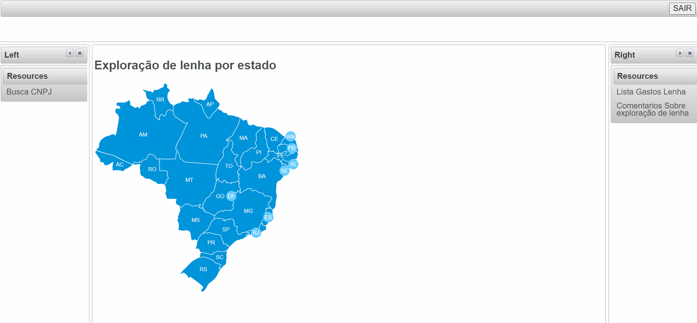
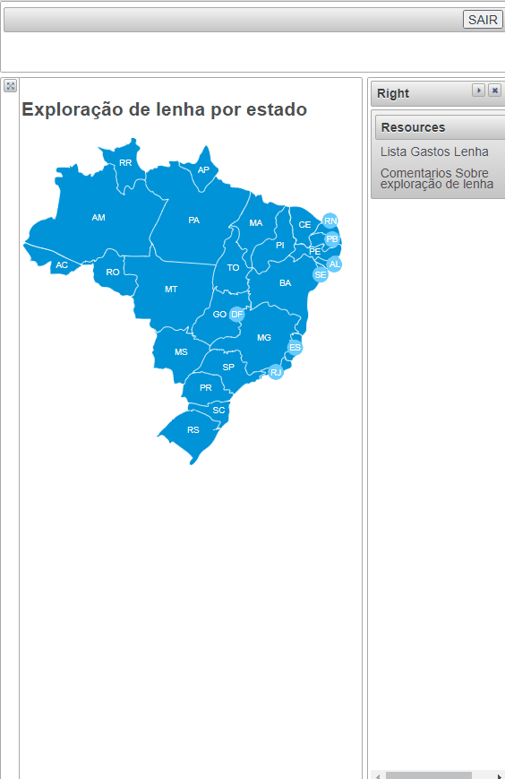

	<h1>Exploração de lenha estados Brasileiro</h1>
	O site mostra os dados fornecidos pelo site da receita, os dados estão em .XML, o sistema tem uma segunda parte que é responsável por atulizar os dados, a atualização é simples, só basta mudar o XML que o sistema pega os novos dados é manda para o banco de dados relacional MySql. Além disso o site tem opções de buscas, realização de comentarios, nas publicações.   
	<h2>Exploração de Lenha dos Estados Brasileiro</h2>
	
	<h2>Comentarios</h2>
	
	<h2>Comentarios</h2>
	
	 
	<h3>Site Java Web, usando persistencia de dados, JPA Hibernate, Spring MVC, PrimeFaces, Banco de dados MySql, uso de web service para consulta de CEP</h3>
 

