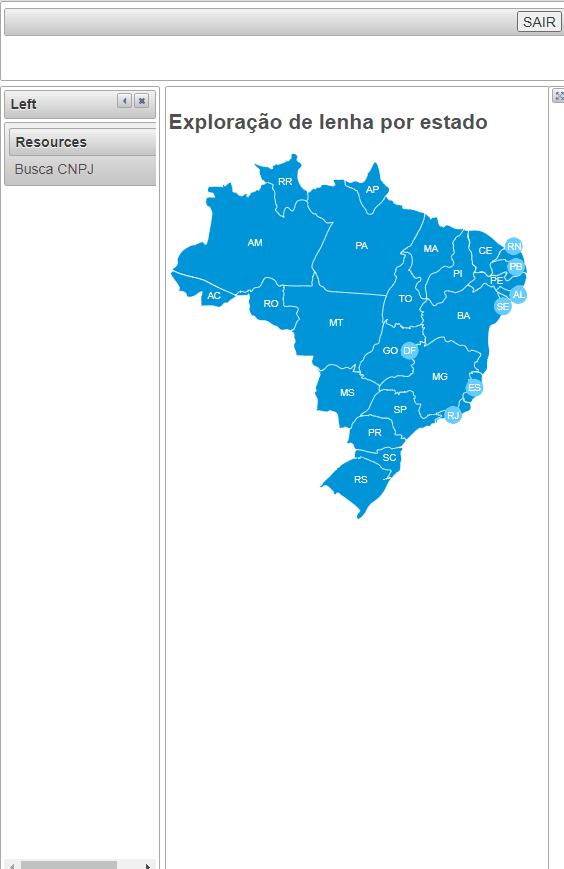
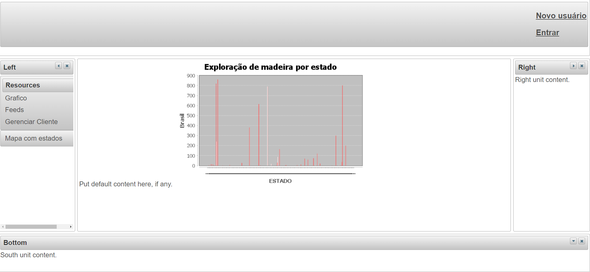
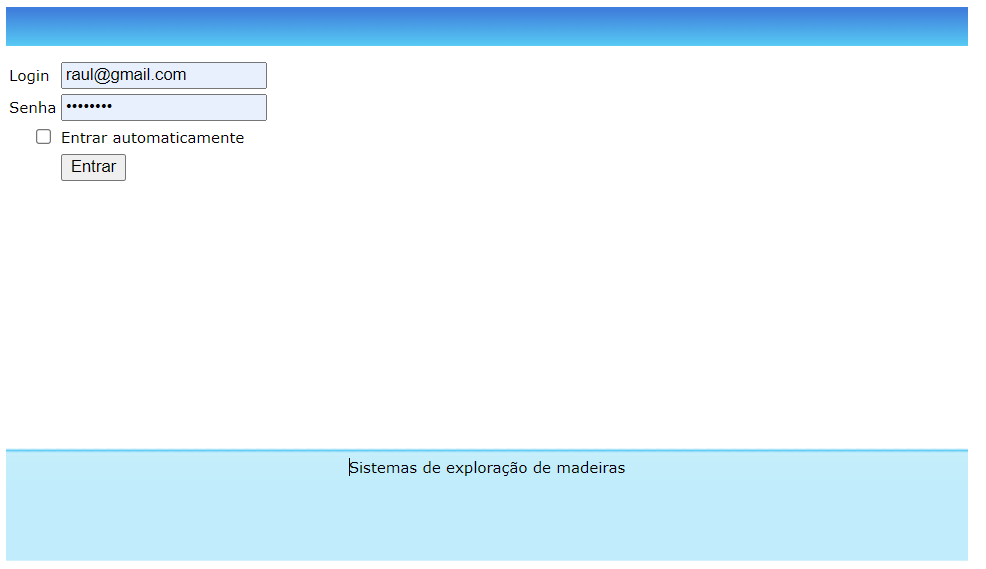
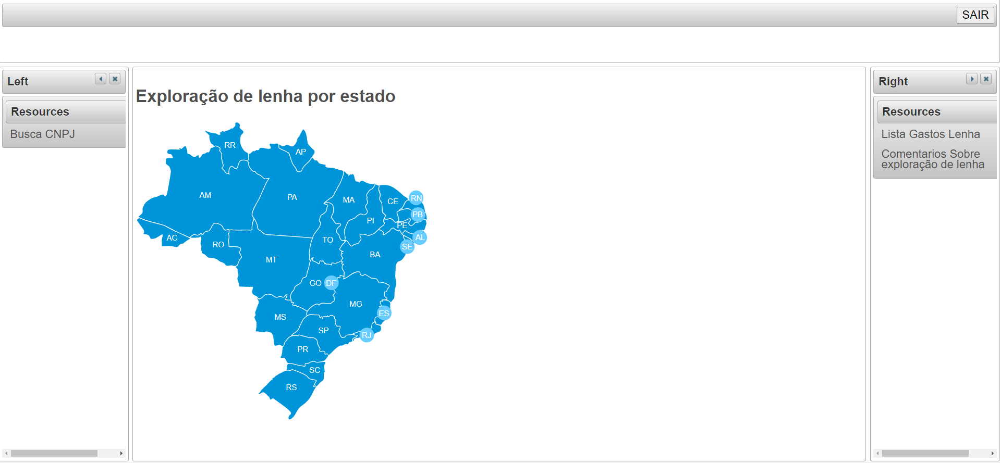

	<h1>Exploração de lenha estados Brasileiro</h1>
	O site mostra os dados fornecidos pelo site da receita, os dados estão em .XML, o sistema tem uma segunda parte que é responsável por atulizar os dados, a atualização é simples, só basta mudar o XML que o sistema pega os novos dados é manda para o banco de dados relacional MySql. Além disso o site tem opções de buscas, realização de comentarios, nas publicações.   
	<h2>Exploração de Lenha dos Estados Brasileiro</h2>
	
	<h2>Comentarios</h2>
	
	<h2>Situação Cadastral da empresa por ano</h2>
	
	<h2>Telas</h2>
	
	
	
	 
	<h3>Tecnologias</h3>
	<ul>
  	<li>NetBeans IDE</li>
  	<li>Java</li>
  	<li>Spring MVC </li>
  	<li>Spring Security</li>
  	<li>XHTML</li>
	<li>Hibernate</li>
	<li>MySql</li>
	<li>Web Service CEP</li>
	</ul>
 

